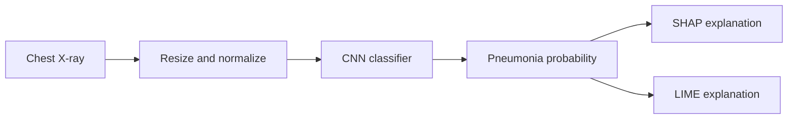

# Explainable Pneumonia Detection from Chest X-Rays
<p align="center">
  
</p>

<p align="center"><em>Project-themed banner generated from an internet-hosted image service for a cleaner GitHub presentation.</em></p>

A deep learning project that classifies chest X-ray images and generates visual explanations with SHAP and LIME.

## Overview

The project trains a convolutional neural network to distinguish normal and pneumonia X-rays. It then explains individual predictions to show which image regions most influenced the model.

This repository is an educational machine learning project and is not a medical device.

## Pipeline



## Model

The TensorFlow/Keras model contains:

- three convolution and max-pooling blocks
- a 128-unit dense layer
- a sigmoid output for binary classification
- Adam optimization and binary cross-entropy loss

Images are resized to 150 × 150 pixels and scaled to the 0–1 range.

## Explainability

- SHAP `GradientExplainer` estimates pixel-level contribution patterns.
- LIME perturbs image regions and highlights areas supporting the predicted class.
- Explanation images are written to separate SHAP and LIME output folders.

Visual explanations can help inspect model behavior, but they do not prove clinical correctness.

## Tech Stack

- Python
- TensorFlow and Keras
- SHAP
- LIME
- scikit-image
- NumPy and Matplotlib

## Project Structure

```text
.
|-- model.py
|-- train.py
|-- predict.py
|-- explain.py
|-- utils.py
|-- requirements.txt
`-- README.md
```

Expected external data and generated artifacts:

```text
data/
|-- train/
|   |-- NORMAL/
|   `-- PNEUMONIA/
|-- val/
|   |-- NORMAL/
|   `-- PNEUMONIA/
`-- test/
    |-- NORMAL/
    `-- PNEUMONIA/

results/
|-- cnn_pneumonia_model.h5
|-- shap_explanations/
`-- lime_explanations/
```

## Installation

```bash
git clone https://github.com/guru8880/pneumonia-detection-using-ML.git
cd pneumonia-detection-using-ML
python -m venv venv
```

```bash
# Windows
venv\Scripts\activate

# macOS/Linux
source venv/bin/activate
```

```bash
pip install -r requirements.txt
```

## Usage

Place the dataset in the expected class folders. The current scripts use `../data` and `../results`; either create those directories one level above the repository or update the path constants before running.

```bash
python train.py
python predict.py
python explain.py
```

Update the example test-image path in `predict.py` and `explain.py` for your dataset.

## Limitations

- no trained model, dataset, or benchmark results are included
- only a simple validation split and five training epochs are configured
- explanations are generated from one selected image at a time
- performance can change across hospitals, imaging devices, and patient populations
- predictions must not be used for diagnosis or treatment decisions

## Future Improvements

- add documented train/validation/test metrics and class-imbalance handling
- use transfer learning and stronger augmentation
- make paths and training settings configurable
- evaluate calibration, sensitivity, specificity, and external generalization
- add reproducible tests and an inference interface
